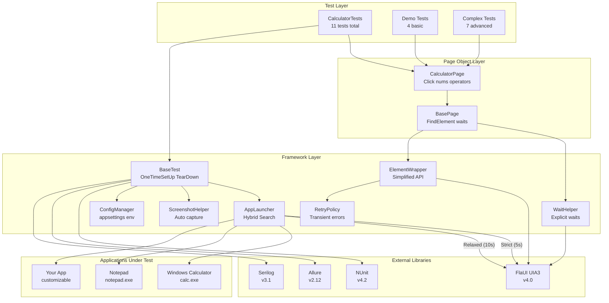
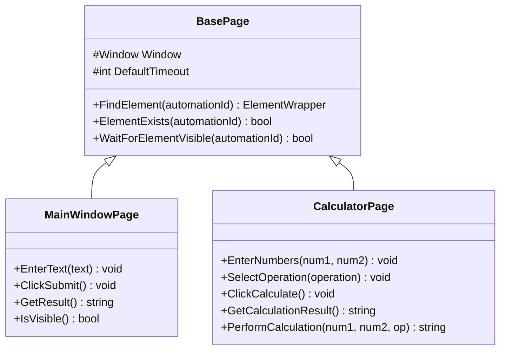
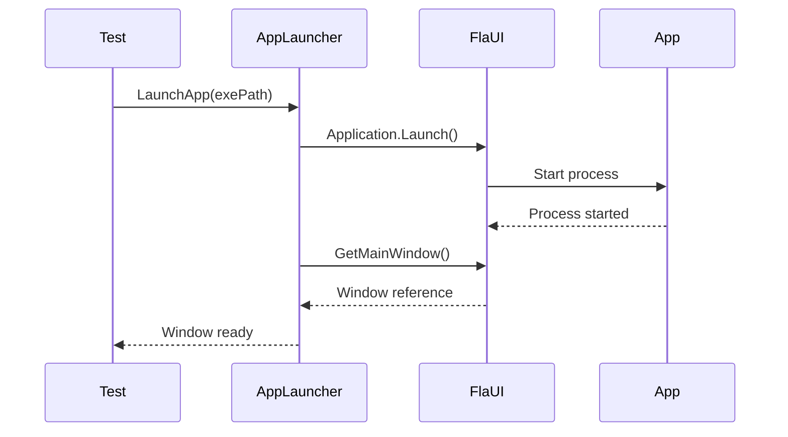
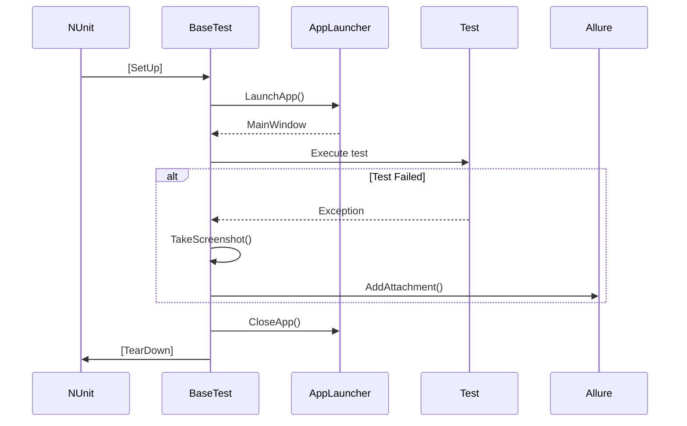
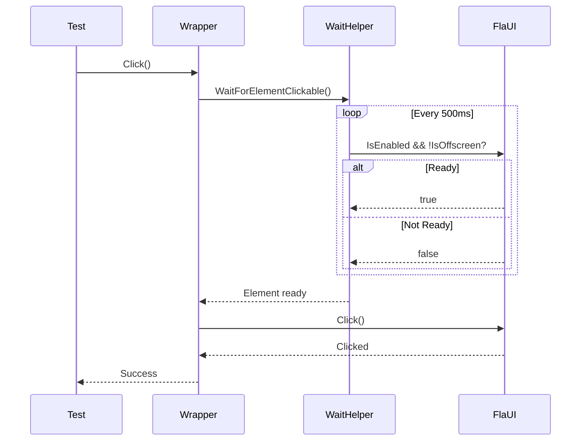
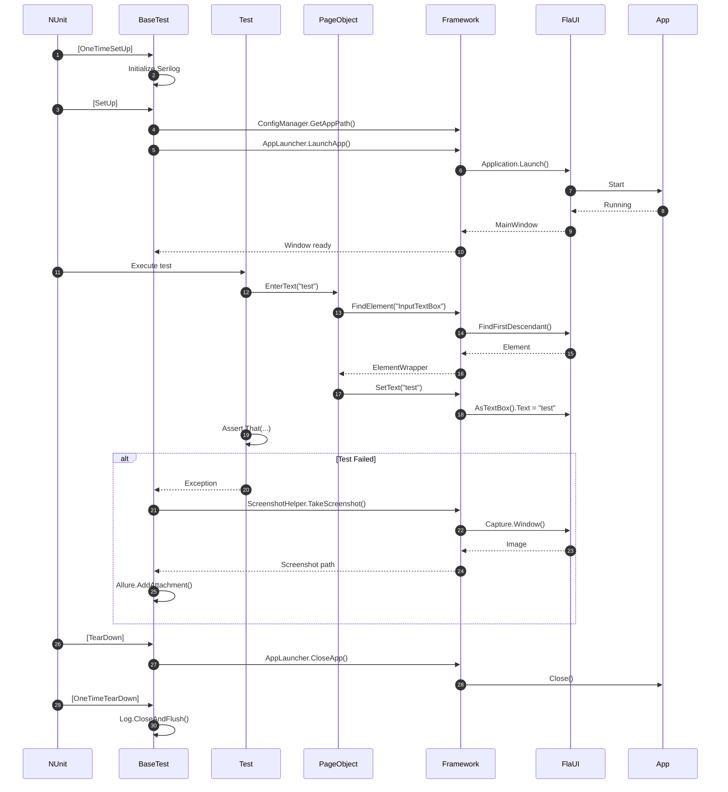

# Arquitectura

Esta página explica la arquitectura del framework Hipos, sus componentes principales y cómo interactúan entre sí.

## Diagrama de Alto Nivel



## Capas del Framework

### 1. Test Layer (Capa de Tests)

**Responsabilidad:** Definir casos de test y aserciones.

**Componentes:**
- `CalculatorTests.cs` - 11 tests contra Calculadora de Windows
  - 4 tests básicos (`Category=Demo`): Verificación de apertura y UI
  - 7 tests complejos (`Category=Complex`): Operaciones matemáticas reales

**Características:**
- Hereda de `BaseTest` para obtener hooks automáticos
- Usa `CalculatorPage` para interaccionar con botones y display
- Incluye tags de Allure (`[AllureTag]`, `[AllureSeverity]`)
- Implementa patrón Arrange-Act-Assert (AAA)
- Tests complejos realizan operaciones reales: suma, resta, multiplicación, división, operaciones secuenciales

**Ejemplo:**
```csharp
[Test]
[Category("Smoke")]
[AllureTag("critical")]
public void VerifyMainWindowOpens()
{
    // Arrange
    var mainWindowPage = new MainWindowPage(MainWindow!);
    
    // Act & Assert
    Assert.That(mainWindowPage.IsVisible(), Is.True);
}
```

### 2. Page Object Layer

**Responsabilidad:** Encapsular elementos UI y acciones de cada página/ventana.

**Componentes:**
- `BasePage.cs` - Clase base con funcionalidad común
- `MainWindowPage.cs` - Página para sección de texto
- `CalculatorPage.cs` - Página para sección de calculadora

**Patrón Page Object:**


**Ventajas:**
- ✅ Reduce duplicación de código
- ✅ Facilita mantenimiento (cambios en UI solo afectan Page Object)
- ✅ Mejora legibilidad de tests
- ✅ Permite reutilización de acciones comunes

### 3. Framework Layer (Core)

**Responsabilidad:** Proporcionar funcionalidad base para automation.

#### AppLauncher (Singleton)
- Lanza y cierra aplicaciones
- Mantiene referencia a la ventana principal
- Maneja timeouts y errores de inicio



#### BaseTest
- Proporciona hooks SetUp/TearDown
- Configura Serilog y Allure
- Captura screenshots en fallos
- Adjunta evidencias al reporte

**Flujo de Ejecución:**


#### WaitHelper
- Esperas explícitas con retry
- Polling configurable
- Logging de intentos
- Condiciones customizables

**Métodos principales:**
- `WaitUntil(condition, timeout)` - Espera genérica
- `WaitForElement(parent, automationId, timeout)` - Espera elemento
- `WaitForWindowTitle(title, timeout)` - Espera ventana
- `WaitForElementEnabled(element, timeout)` - Espera habilitación

#### ElementWrapper
- API simplificada sobre AutomationElement
- Esperas implícitas antes de acciones
- Logging automático de interacciones
- Manejo robusto de errores

**Flujo Click:**


#### ScreenshotHelper
- Captura de pantalla con FlaUI
- Guardado automático en allure-results/
- Fallback a pantalla completa si no hay ventana
- Sanitización de nombres de archivo

#### ConfigManager (Singleton)
- Lectura de appsettings.json
- Soporte para múltiples ambientes (Development, Production)
- Variables de entorno sobrescriben valores
- Propiedades tipadas para acceso fácil

### 4. External Libraries

#### FlaUI (UIA3)
- **UI Automation 3.0** - Última versión de Microsoft UI Automation
- Soporte para Win32, WPF, WinForms, UWP
- Mejor rendimiento que UIA2
- API fluida y moderna

#### NUnit
- Framework de testing maduro
- Atributos para categorización
- Test fixtures y setup/teardown
- Asserts expresivos

#### Allure
- Reportes HTML interactivos
- Screenshots y adjuntos
- Categorización con tags
- Trends y estadísticas

#### Serilog
- Logging estructurado
- Múltiples sinks (file, console, etc.)
- Niveles configurables
- Performance óptimo

## Patrones de Diseño

### Singleton Pattern
- `AppLauncher` - Una sola instancia para toda la suite
- `ConfigManager` - Configuración centralizada

### Page Object Pattern
- Encapsulación de elementos y acciones
- Separación de concerns
- Mantenibilidad

### Factory Pattern (implícito)
- `AppLauncher.LaunchApp()` actúa como factory para Window

### Wrapper Pattern
- `ElementWrapper` envuelve `AutomationElement`
- Añade funcionalidad sin modificar la clase original

## Flujo Completo de un Test



## Principios de Diseño

### SOLID

- **Single Responsibility**: Cada clase tiene una responsabilidad única
- **Open/Closed**: Extensible mediante herencia (BaseTest, BasePage)
- **Liskov Substitution**: Page Objects son intercambiables
- **Interface Segregation**: Interfaces pequeñas y específicas
- **Dependency Inversion**: Dependencia en abstracciones (IConfiguration)

### DRY (Don't Repeat Yourself)
- Helpers y wrappers evitan código duplicado
- BaseTest y BasePage centralizan lógica común

### KISS (Keep It Simple)
- API clara y fácil de usar
- Convenciones sobre configuración
- Defaults sensibles

### Separation of Concerns
- Tests no conocen detalles de FlaUI
- Page Objects no conocen detalles de Allure
- Framework proporciona abstracciones

## Extensibilidad

El framework está diseñado para ser fácilmente extensible:

### Añadir Nuevo Page Object
```csharp
public class NewPage : BasePage
{
    public NewPage(Window window) : base(window) { }
    
    // Tu lógica aquí
}
```

### Añadir Nuevo Helper
```csharp
public static class CustomHelper
{
    public static void DoSomething() { }
}
```

### Custom Configuration
```json
{
  "CustomSetting": "value"
}
```

```csharp
var customValue = ConfigManager.Instance.GetValue("CustomSetting", "default");
```

## Próximos Pasos

- **[Framework Guide](./framework-guide.md)** - Uso detallado de cada componente
- **[Reporting](./reporting-logging.md)** - Configuración de reportes
- **[CI/CD](./ci-cd.md)** - Integración continua
