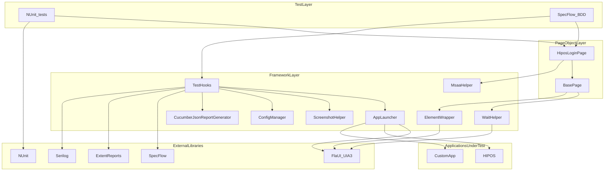
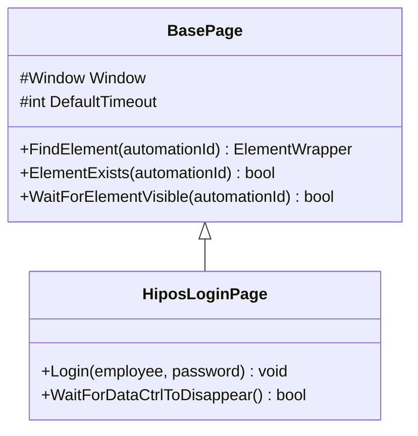
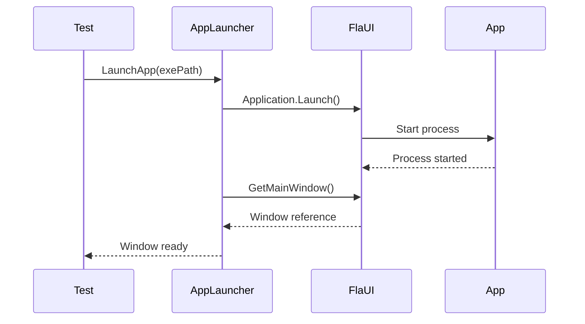
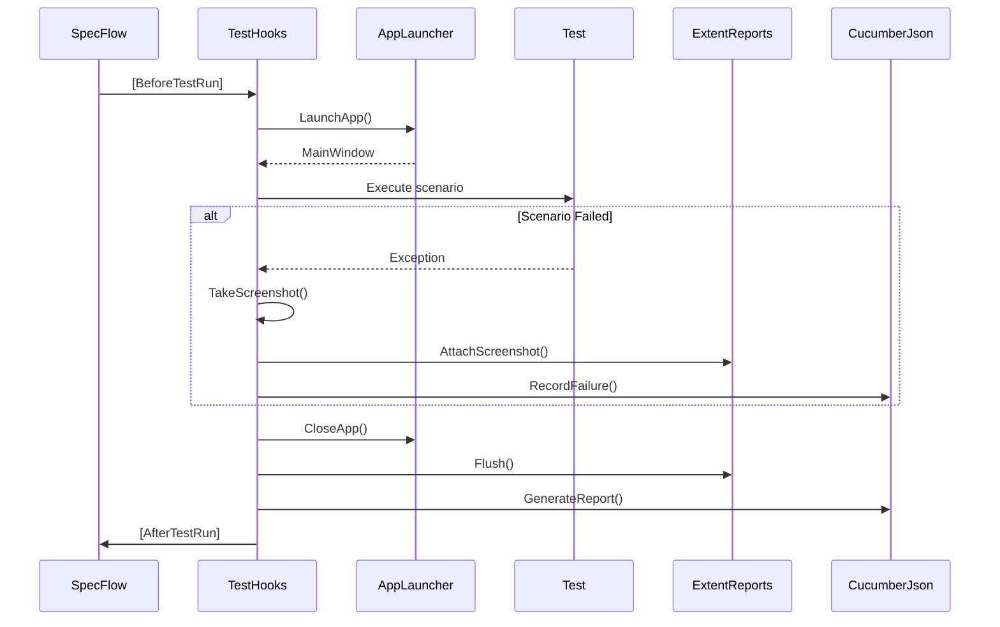
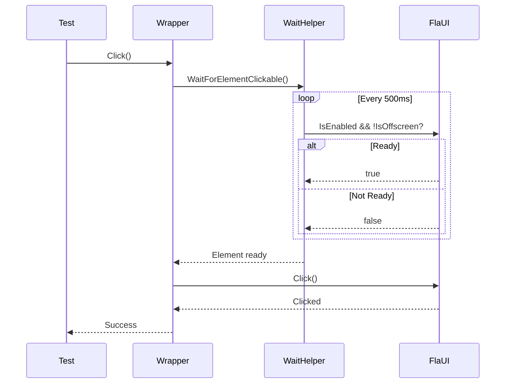
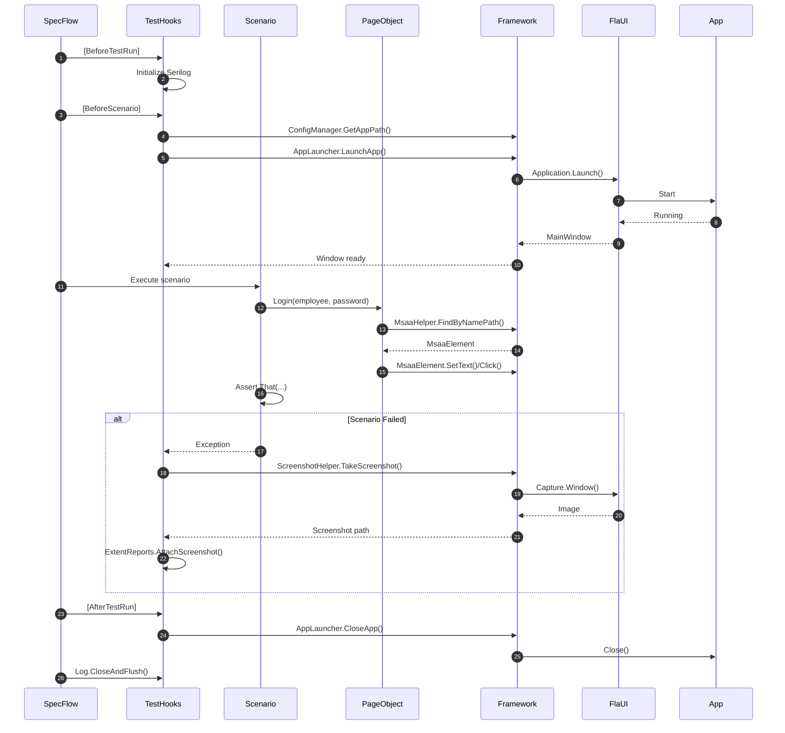

# Architecture

This page explains the Hipos framework architecture, its main components, and how they interact.

## High-Level Diagram



## Framework Layers

### 1. Test Layer

**Responsibility:** Define test cases and assertions.

**Components:**
- `Login.feature` - BDD scenarios for HIPOS login
  - Uses SpecFlow step definitions
  - Generates Cucumber JSON for Jira/Xray

**Features:**
- Uses `BaseStepDefinitions` for common logging
- Uses `HiposLoginPage` to interact with MSAA controls
- Includes ExtentReports logging

**Example (SpecFlow):**

```gherkin
Feature: HIPOS login
  Scenario: Successful login hides datactrl
    Given the HIPOS login page is open
    When I login with employee "-1" and password "000000"
    Then the datactrl element should not exist
```

### 2. Page Object Layer

**Responsibility:** Encapsulate UI elements and actions for each page/window.

**Components:**
- `BasePage.cs` - Base class with common functionality
- `HiposLoginPage.cs` - Page for HIPOS login using MSAA

**Page Object Pattern:**



**Advantages:**
- ✅ Reduces code duplication
- ✅ Facilitates maintenance (UI changes only affect Page Object)
- ✅ Improves test readability
- ✅ Allows reuse of common actions

### 3. Framework Layer (Core)

**Responsibility:** Provide base functionality for automation.

#### AppLauncher (Singleton)
- Launches and closes applications
- Maintains reference to main window
- Handles timeouts and startup errors



#### TestHooks
- Provides lifecycle hooks for SpecFlow scenarios
- Configures Serilog, ExtentReports, and CucumberJsonReportGenerator
- Captures screenshots on scenario failures
- Tracks feature/scenario/step execution
- Generates Cucumber JSON for Jira/Xray

**Execution Flow:**



#### WaitHelper
- Explicit waits with retry
- Configurable polling
- Attempt logging
- Customizable conditions

**Main Methods:**
- `WaitUntil(condition, timeout)` - Generic wait
- `WaitForElement(parent, automationId, timeout)` - Wait for element
- `WaitForWindowTitle(title, timeout)` - Wait for window
- `WaitForElementEnabled(element, timeout)` - Wait for enable

#### ElementWrapper
- Simplified API over AutomationElement
- Implicit waits before actions
- Automatic interaction logging
- Robust error handling

**Click Flow:**



#### ScreenshotHelper
- Screenshot capture with FlaUI
- Automatic save to reports/screenshots/
- Fallback to full screen if no window
- Filename sanitization

#### ConfigManager (Singleton)
- Reads appsettings.json
- Support for multiple environments (Development, Production)
- Environment variables override values
- Typed properties for easy access

#### CucumberJsonReportGenerator
- Converts SpecFlow results to Cucumber JSON format
- Compatible with Jira/Xray import
- Tracks features, scenarios, steps
- Records execution status, duration, errors
- Optional screenshot embedding

### 4. External Libraries

#### FlaUI (UIA3)
- **UI Automation 3.0** - Latest version of Microsoft UI Automation
- Support for Win32, WPF, WinForms, UWP
- Better performance than UIA2
- Modern fluent API

#### NUnit
- Mature testing framework
- Attributes for categorization
- Test fixtures and setup/teardown
- Expressive asserts

#### SpecFlow
- BDD framework for .NET
- Gherkin syntax support
- Given-When-Then scenarios
- Integration with NUnit

#### ExtentReports
- Interactive HTML reports
- Screenshots and attachments
- Categorization with tags
- Dark theme

#### Serilog
- Structured logging
- Multiple sinks (file, console, etc.)
- Configurable levels
- Optimal performance

## Design Patterns

### Singleton Pattern
- `AppLauncher` - Single instance for entire suite
- `ConfigManager` - Centralized configuration

### Page Object Pattern
- Encapsulation of elements and actions
- Separation of concerns
- Maintainability

### Factory Pattern (implicit)
- `AppLauncher.LaunchApp()` acts as factory for Window

### Wrapper Pattern
- `ElementWrapper` wraps `AutomationElement`
- Adds functionality without modifying original class

## Complete Test Flow



## Design Principles

### SOLID

- **Single Responsibility**: Each class has a single responsibility
- **Open/Closed**: Extensible through inheritance (BasePage)
- **Liskov Substitution**: Page Objects are interchangeable
- **Interface Segregation**: Small and specific interfaces
- **Dependency Inversion**: Dependency on abstractions (IConfiguration)

### DRY (Don't Repeat Yourself)
- Helpers and wrappers avoid duplicate code
- BasePage centralizes common logic

### KISS (Keep It Simple)
- Clear and easy-to-use API
- Convention over configuration
- Sensible defaults

### Separation of Concerns
- Tests don't know FlaUI details
- Page Objects don't know ExtentReports details
- Framework provides abstractions

## Extensibility

The framework is designed to be easily extensible:

### Add New Page Object

```csharp
public class NewPage : BasePage
{
    public NewPage(Window window) : base(window) { }
    
    // Your logic here
}
```

### Add New Helper

```csharp
public static class CustomHelper
{
    public static void DoSomething() { }
}
```

### Custom Configuration

```json
{
  "CustomSetting": "value"
}
```

```csharp
var customValue = ConfigManager.Instance.GetValue("CustomSetting", "default");
```

## Next Steps

- **[Framework Guide](./framework-guide.md)** - Detailed usage of each component
- **[Reporting & Logging](./reporting-logging.md)** - Report configuration
- **[CI/CD](./ci-cd.md)** - Continuous integration
