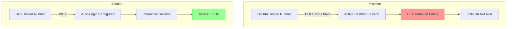
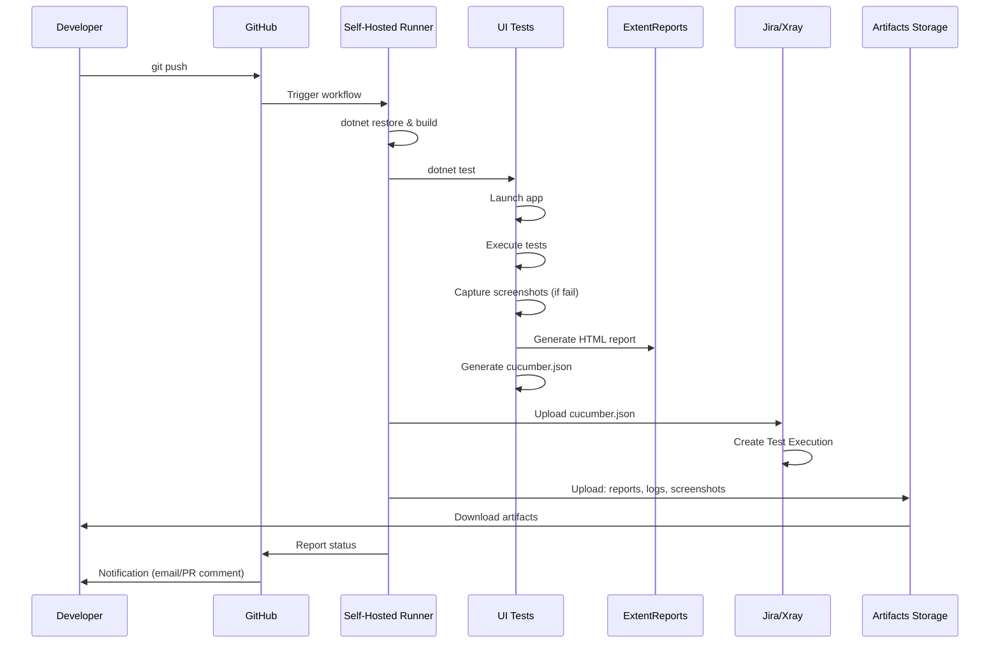

# CI/CD Integration

Complete guide to integrate Hipos with CI/CD pipelines.

## ⚠️ Critical Limitation: Interactive Session

### The Problem

**Desktop UI tests on Windows require an active interactive desktop session.**



### What is an Interactive Session?

An **interactive session** means:
- ✅ User logged into Windows
- ✅ Desktop visible (even if virtual/headless)
- ✅ UI Automation can access visual elements
- ✅ No active lock screen

### Why It Fails on GitHub-Hosted Runners

GitHub-hosted Windows runners:
- ❌ Run as background service
- ❌ Do not have active desktop session
- ❌ UI Automation cannot "see" windows
- ❌ Tests fail with timeout or element not found errors

## Real Solutions

### Option 1: Self-Hosted Runner (Recommended)

**Setup:**

1. **Prepare Windows Machine**
   - Windows 10/11 or Windows Server
   - .NET 8 installed
   - Auto-login configured

2. **Configure Auto-Login**

```powershell
# Open Registry Editor
# HKEY_LOCAL_MACHINE\SOFTWARE\Microsoft\Windows NT\CurrentVersion\Winlogon

# Set:
AutoAdminLogon = "1"
DefaultUserName = "runner_user"
DefaultPassword = "your_secure_password"
DefaultDomainName = "WORKGROUP" # or your domain
```

Or use tool:

```powershell
# Sysinternals Autologon
.\Autologon.exe /accepteula
```

3. **Install GitHub Runner**

```powershell
# Download runner
mkdir actions-runner && cd actions-runner
Invoke-WebRequest -Uri https://github.com/actions/runner/releases/download/v2.311.0/actions-runner-win-x64-2.311.0.zip -OutFile actions-runner-win-x64-2.311.0.zip
Expand-Archive -Path actions-runner-win-x64-2.311.0.zip -DestinationPath .

# Configure
.\config.cmd --url https://github.com/YOUR_ORG/YOUR_REPO --token YOUR_TOKEN

# Install as service (NOT recommended for UI tests)
# Instead, run in interactive session:
.\run.cmd
```

4. **Run Runner in Interactive Session**

Create scheduled task that starts runner at login:

```powershell
# Task Scheduler
# Trigger: At log on
# Action: Start a program
# Program: C:\actions-runner\run.cmd
# Run whether user is logged on or not: NO (must be logged on)
```

**Modified Workflow:**

```yaml
name: UI Tests (Self-Hosted)

on: [push, pull_request]

jobs:
  test:
    runs-on: [self-hosted, windows, ui-capable]
    # Label 'ui-capable' to identify runners with interactive session
    
    steps:
      - uses: actions/checkout@v4
      
      - name: Setup .NET
        uses: actions/setup-dotnet@v4
        with:
          dotnet-version: '8.0.x'
      
      - name: Restore & Build
        run: |
          dotnet restore
          dotnet build --no-restore
      
      - name: Run UI Tests
        run: dotnet test --no-build
      
      - name: Upload ExtentReports HTML
        if: always()
        uses: actions/upload-artifact@v4
        with:
          name: extent-report
          path: src/Hipos.Tests/bin/Debug/net8.0-windows/reports/extent-report.html
          retention-days: 30
      
      - name: Upload Cucumber JSON
        if: always()
        uses: actions/upload-artifact@v4
        with:
          name: cucumber-json-report
          path: src/Hipos.Tests/bin/Debug/net8.0-windows/reports/cucumber.json
          retention-days: 30
      
      - name: Upload Screenshots
        if: always()
        uses: actions/upload-artifact@v4
        with:
          name: screenshots
          path: src/Hipos.Tests/bin/Debug/net8.0-windows/reports/screenshots/
          retention-days: 30
      
      - name: Upload Logs
        if: always()
        uses: actions/upload-artifact@v4
        with:
          name: test-logs
          path: src/Hipos.Tests/bin/Debug/net8.0-windows/logs/
          retention-days: 30
```

### Option 2: Azure DevOps with Interactive Agent

Azure DevOps allows configuring agents in interactive mode.

**azure-pipelines.yml:**

```yaml
trigger:
  - main

pool:
  name: 'Windows-UI-Pool'  # Pool with interactive agent

variables:
  solution: '**/*.sln'
  buildPlatform: 'Any CPU'
  buildConfiguration: 'Release'

steps:
  - task: NuGetToolInstaller@1
  
  - task: NuGetCommand@2
    inputs:
      restoreSolution: '$(solution)'
  
  - task: VSBuild@1
    inputs:
      solution: '$(solution)'
      platform: '$(buildPlatform)'
      configuration: '$(buildConfiguration)'
  
  - task: VSTest@2
    inputs:
      testSelector: 'testAssemblies'
      testAssemblyVer2: |
        **\*Tests*.dll
        !**\*TestAdapter.dll
        !**\obj\**
      searchFolder: '$(System.DefaultWorkingDirectory)'
      runSettingsFile: # Optional
      codeCoverageEnabled: true
  
  - task: PublishTestResults@2
    condition: always()
    inputs:
      testResultsFormat: 'NUnit'
      testResultsFiles: '**/TestResults/*.trx'
  
  - task: PublishBuildArtifacts@1
    condition: always()
    inputs:
      PathtoPublish: 'reports/extent-report.html'
      ArtifactName: 'extent-report'
  
  - task: PublishBuildArtifacts@1
    condition: always()
    inputs:
      PathtoPublish: 'reports/cucumber.json'
      ArtifactName: 'cucumber-json-report'
```

**Configure Interactive Agent:**

1. Install agent on Windows
2. **DO NOT install as service**
3. Configure auto-login
4. Run agent from interactive session:

```cmd
.\run.cmd
```

5. Create scheduled task for auto-start

### Option 3: Dedicated VM with Persistent RDP

**Setup:**

1. **Create Windows VM in Cloud** (Azure, AWS, GCP)
   - Windows Server 2019/2022
   - RDP enabled
   - Static IP

2. **Configure Persistent RDP**

Keep RDP session always active using tool like `tscon`:

```batch
@echo off
for /f "skip=1 tokens=3" %%s in ('query user %USERNAME%') do (
  %windir%\System32\tscon.exe %%s /dest:console
)
```

Save as `disconnect.bat` and run on RDP disconnect.

3. **Install Runner/Agent**

Follow steps from Option 1 or 2.

4. **Keep Session Active**

PowerShell script that prevents lock screen:

```powershell
# keep-alive.ps1
param($minutes = 360)

$myShell = New-Object -com "Wscript.Shell"

for ($i = 0; $i -lt $minutes; $i++) {
  Start-Sleep -Seconds 60
  $myShell.sendkeys("{F15}")  # Key that does nothing but keeps active
}
```

Run in scheduled task every 6 hours.

## Jira/Xray Integration

Hipos generates `cucumber.json` reports compatible with Jira/Xray for automatic test result import.

### Upload to Xray via API

After tests complete, upload the generated `cucumber.json` to Xray:

#### GitHub Actions Example

```yaml
name: UI Tests with Xray Upload

on: [push, pull_request]

jobs:
  test:
    runs-on: [self-hosted, windows, ui-capable]
    
    steps:
      - uses: actions/checkout@v4
      
      - name: Setup .NET
        uses: actions/setup-dotnet@v4
        with:
          dotnet-version: '8.0.x'
      
      - name: Restore & Build
        run: |
          dotnet restore
          dotnet build --no-restore
      
      - name: Run UI Tests
        run: dotnet test --no-build
        continue-on-error: true
      
      - name: Upload to Xray
        if: always()
        shell: powershell
        run: |
          $cucumberJsonPath = "src/Hipos.Tests/bin/Debug/net8.0-windows/reports/cucumber.json"
          
          if (Test-Path $cucumberJsonPath) {
            $headers = @{
              "Content-Type" = "application/json"
              "Authorization" = "Bearer ${{ secrets.XRAY_API_TOKEN }}"
            }
            
            $response = Invoke-RestMethod `
              -Uri "https://xray.cloud.getxray.app/api/v2/import/execution/cucumber" `
              -Method Post `
              -Headers $headers `
              -InFile $cucumberJsonPath
            
            Write-Host "Upload to Xray successful. Test Execution Key: $($response.key)"
          } else {
            Write-Host "Cucumber JSON report not found at $cucumberJsonPath"
            exit 1
          }
      
      - name: Upload Artifacts
        if: always()
        uses: actions/upload-artifact@v4
        with:
          name: test-results
          path: |
            src/Hipos.Tests/bin/Debug/net8.0-windows/reports/
            src/Hipos.Tests/bin/Debug/net8.0-windows/logs/
```

#### Azure Pipelines Example

```yaml
- task: PowerShell@2
  displayName: 'Upload Results to Xray'
  condition: always()
  inputs:
    targetType: 'inline'
    script: |
      $cucumberJsonPath = "src/Hipos.Tests/bin/Debug/net8.0-windows/reports/cucumber.json"
      
      if (Test-Path $cucumberJsonPath) {
        $headers = @{
          "Content-Type" = "application/json"
          "Authorization" = "Bearer $(XRAY_API_TOKEN)"
        }
        
        $response = Invoke-RestMethod `
          -Uri "https://xray.cloud.getxray.app/api/v2/import/execution/cucumber" `
          -Method Post `
          -Headers $headers `
          -InFile $cucumberJsonPath
        
        Write-Host "Upload to Xray successful. Test Execution Key: $($response.key)"
      } else {
        Write-Host "Cucumber JSON report not found"
        exit 1
      }
```

### Xray Authentication

#### Option 1: API Token (Recommended)

1. In Jira, go to Xray → Settings → API Keys
2. Generate new API Token
3. Store in CI secrets:
   - GitHub: Repository → Settings → Secrets → Actions
   - Azure DevOps: Pipelines → Library → Variable Groups

#### Option 2: Client ID/Secret

```powershell
# Get bearer token
$authBody = @{
  client_id = "${{ secrets.XRAY_CLIENT_ID }}"
  client_secret = "${{ secrets.XRAY_CLIENT_SECRET }}"
} | ConvertTo-Json

$authResponse = Invoke-RestMethod `
  -Uri "https://xray.cloud.getxray.app/api/v2/authenticate" `
  -Method Post `
  -ContentType "application/json" `
  -Body $authBody

$token = $authResponse

# Upload results
$headers = @{
  "Content-Type" = "application/json"
  "Authorization" = "Bearer $token"
}

Invoke-RestMethod `
  -Uri "https://xray.cloud.getxray.app/api/v2/import/execution/cucumber" `
  -Method Post `
  -Headers $headers `
  -InFile "reports/cucumber.json"
```

### Xray Import Options

You can customize the import with query parameters:

```powershell
# Create new Test Execution
$uri = "https://xray.cloud.getxray.app/api/v2/import/execution/cucumber"

# Update existing Test Execution
$testExecutionKey = "PROJ-123"
$uri = "https://xray.cloud.getxray.app/api/v2/import/execution/cucumber?testExecKey=$testExecutionKey"

# Link to Test Plan
$testPlanKey = "PROJ-456"
$uri = "https://xray.cloud.getxray.app/api/v2/import/execution/cucumber?testPlanKey=$testPlanKey"

# Specify Test Environments
$testEnvironments = "Windows11,Chrome"
$uri = "https://xray.cloud.getxray.app/api/v2/import/execution/cucumber?testEnvironments=$testEnvironments"
```

### Tag Mapping

SpecFlow tags are automatically mapped to Xray:

```gherkin
@Hipos @Smoke @PROJ-123
Feature: HIPOS login
  As a user
  I want to login to HIPOS
  
  @PROJ-124
  Scenario: Successful login hides datactrl
    Given the HIPOS login page is open
    When I login with employee "-1" and password "000000"
    Then the datactrl element should not exist
```

- `@PROJ-123`: Links feature to Jira issue
- `@PROJ-124`: Links scenario to Test Case
- `@Smoke`: Tag for categorization

## Complete CI/CD Pipeline



## Strategies by Test Type

### Smoke Tests
- ✅ Run on every PR
- ✅ Short timeout (5-10 min)
- ✅ Only critical functionality
- ✅ Block merge if they fail

```yaml
jobs:
  smoke-tests:
    runs-on: [self-hosted, windows, ui-tests]
    timeout-minutes: 10
    steps:
      - # ...
      - name: Run Smoke Tests
        run: dotnet test --filter "Category=Smoke"
```

### Regression Tests
- ✅ Run on push to main
- ✅ Run nightly (scheduled)
- ✅ Full suite
- ✅ Don't block merge (only notify)

```yaml
on:
  push:
    branches: [main]
  schedule:
    - cron: '0 2 * * *'  # 2 AM daily

jobs:
  regression:
    runs-on: [self-hosted, windows, ui-tests]
    timeout-minutes: 60
    steps:
      - # ...
      - name: Run All Tests
        run: dotnet test
```

## Artifacts and Reports

### Publish Documentation to GitHub Pages

**1. Workflow for docs (`.github/workflows/docs.yml` already included):**

The workflow has two jobs: **build** (checkout, setup Node, `npm ci` + `npm run build` in `website/`, then `upload-pages-artifact` with `path: ./website/build`) and **deploy** (uses `actions/deploy-pages@v4` to publish the artifact).

**2. Enable GitHub Pages:**
- Repo → Settings → Pages
- **Build and deployment → Source:** select **GitHub Actions** (not "Deploy from a branch")

No branch or folder needs to be configured; the workflow publishes the Docusaurus build automatically.

**3. Access:**
`https://<usuario-o-org>.github.io/Hipos/`

### Artifact Retention

By default, artifacts are saved for 90 days. Modify:

```yaml
- uses: actions/upload-artifact@v4
  with:
    name: extent-report
    path: reports/extent-report.html
    retention-days: 30  # Change as needed
```

## Best Practices

### ✅ DO

- Use self-hosted runner for UI tests
- Configure auto-login and persistent session
- Run smoke tests on PRs, regression nightly
- Upload artifacts with `always()` (even if tests fail)
- Use specific labels for UI-capable runners
- Monitor runner health (disk space, memory)
- Automate Xray upload for test traceability

### ❌ DON'T

- Don't assume GitHub-hosted runner will work
- Don't share UI runners between multiple repos without isolation
- Don't save credentials in workflows (use secrets)
- Don't run parallel tests on same runner (UI conflicts)
- Don't ignore CI failures ("works on my machine")
- Don't commit Xray API tokens to repository

## Monitoring and Alerts

### Slack/Teams Notifications

```yaml
- name: Send notification
  if: failure()
  uses: 8398a7/action-slack@v3
  with:
    status: ${{ job.status }}
    text: 'UI Tests failed! See artifacts for details.'
    webhook_url: ${{ secrets.SLACK_WEBHOOK }}
```

### Email Notifications

GitHub sends automatic emails on failures if configured in:
- Settings → Notifications → Actions

## Troubleshooting CI

### Tests pass locally but fail in CI

Possible causes:
1. **No interactive session** → Use self-hosted with auto-login
2. **Different screen resolution** → Configure fixed resolution in VM
3. **Different permissions** → Run runner with same permissions as local
4. **Timeouts too short** → Increase in `appsettings.json`

### Runner disconnects frequently

- Verify VM doesn't enter sleep mode
- Disable Windows automatic updates
- Monitor memory/disk usage

### Screenshots not captured in CI

- Verify session is active (not locked)
- Check write permissions in directory
- Try full screen capture as fallback

### Xray upload fails

- Verify API token is valid and not expired
- Check cucumber.json file exists and is valid JSON
- Verify network connectivity to Xray API
- Check Xray project permissions

## Additional Resources

- [GitHub Self-Hosted Runners](https://docs.github.com/en/actions/hosting-your-own-runners)
- [Azure DevOps Agents](https://docs.microsoft.com/en-us/azure/devops/pipelines/agents/agents)
- [FlaUI CI Best Practices](https://github.com/FlaUI/FlaUI/wiki) - For window management in CI/CD
- **Note:** Hipos uses FlaUI for window management and MSAA (via FlaUI handles) for UI interactions
- [Xray API Documentation](https://docs.getxray.app/display/XRAYCLOUD/Import+Execution+Results+-+REST+v2)

## Next Steps

- **[Troubleshooting](./troubleshooting.md)** - Solve problems
- **[Contributing](./contributing.md)** - Contribute to the project
