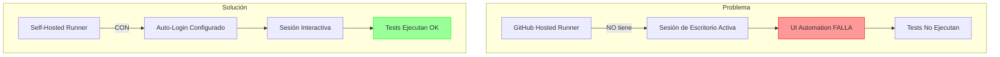
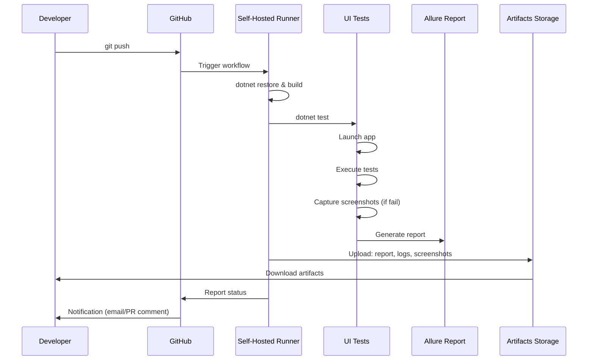

# CI/CD Integration

Guía completa para integrar Hipos con pipelines de CI/CD.

## ⚠️ Limitación Crítica: Sesión Interactiva

### El Problema

**Los tests de UI Desktop en Windows requieren una sesión de escritorio interactiva activa.**



### ¿Qué es una Sesión Interactiva?

Una **sesión interactiva** significa:
- ✅ Usuario loggeado en Windows
- ✅ Escritorio visible (aunque sea virtual/headless)
- ✅ UI Automation puede acceder a elementos visuales
- ✅ No hay lock screen activo

### Por Qué Falla en GitHub-Hosted Runners

GitHub-hosted runners de Windows:
- ❌ Ejecutan como servicio en background
- ❌ No tienen sesión de escritorio activa
- ❌ UI Automation no puede "ver" ventanas
- ❌ Tests fallan con errores de timeout o elementos no encontrados

## Soluciones Reales

### Opción 1: Self-Hosted Runner (Recomendado)

**Setup:**

1. **Preparar Máquina Windows**
   - Windows 10/11 o Windows Server
   - .NET 8 instalado
   - Auto-login configurado

2. **Configurar Auto-Login**

```powershell
# Abrir Registry Editor
# HKEY_LOCAL_MACHINE\SOFTWARE\Microsoft\Windows NT\CurrentVersion\Winlogon

# Establecer:
AutoAdminLogon = "1"
DefaultUserName = "runner_user"
DefaultPassword = "your_secure_password"
DefaultDomainName = "WORKGROUP" # o tu dominio
```

O usar herramienta:
```powershell
# Sysinternals Autologon
.\Autologon.exe /accepteula
```

3. **Instalar GitHub Runner**

```powershell
# Descargar runner
mkdir actions-runner && cd actions-runner
Invoke-WebRequest -Uri https://github.com/actions/runner/releases/download/v2.311.0/actions-runner-win-x64-2.311.0.zip -OutFile actions-runner-win-x64-2.311.0.zip
Expand-Archive -Path actions-runner-win-x64-2.311.0.zip -DestinationPath .

# Configurar
.\config.cmd --url https://github.com/YOUR_ORG/YOUR_REPO --token YOUR_TOKEN

# Instalar como servicio (NO recomendado para UI tests)
# En su lugar, ejecutar en sesión interactiva:
.\run.cmd
```

4. **Ejecutar Runner en Sesión Interactiva**

Crear tarea programada que inicie el runner al login:

```powershell
# Task Scheduler
# Trigger: At log on
# Action: Start a program
# Program: C:\actions-runner\run.cmd
# Run whether user is logged on or not: NO (debe estar logged on)
```

**Workflow Modificado:**

```yaml
name: UI Tests (Self-Hosted)

on: [push, pull_request]

jobs:
  test:
    runs-on: [self-hosted, windows, ui-capable]
    # Label 'ui-capable' para identificar runners con sesión interactiva
    
    steps:
      - uses: actions/checkout@v4
      
      - name: Setup .NET
        uses: actions/setup-dotnet@v4
        with:
          dotnet-version: '8.0.x'
      
      - name: Restore & Build
        run: |
          dotnet restore
          dotnet build --no-restore
      
      - name: Run UI Tests
        run: dotnet test --no-build
      
      - name: Generate Allure Report
        if: always()
        run: allure generate src/Hipos.Tests/bin/Debug/net8.0-windows/allure-results -o allure-report --clean
      
      - name: Upload Artifacts
        if: always()
        uses: actions/upload-artifact@v4
        with:
          name: test-results
          path: |
            allure-report/
            **/logs/
```

### Opción 2: Azure DevOps con Agent Interactivo

Azure DevOps permite configurar agents en modo interactivo.

**azure-pipelines.yml:**

```yaml
trigger:
  - main

pool:
  name: 'Windows-UI-Pool'  # Pool con agent interactivo

variables:
  solution: '**/*.sln'
  buildPlatform: 'Any CPU'
  buildConfiguration: 'Release'

steps:
  - task: NuGetToolInstaller@1
  
  - task: NuGetCommand@2
    inputs:
      restoreSolution: '$(solution)'
  
  - task: VSBuild@1
    inputs:
      solution: '$(solution)'
      platform: '$(buildPlatform)'
      configuration: '$(buildConfiguration)'
  
  - task: VSTest@2
    inputs:
      testSelector: 'testAssemblies'
      testAssemblyVer2: |
        **\*Tests*.dll
        !**\*TestAdapter.dll
        !**\obj\**
      searchFolder: '$(System.DefaultWorkingDirectory)'
      runSettingsFile: # Opcional
      codeCoverageEnabled: true
  
  - task: PublishTestResults@2
    condition: always()
    inputs:
      testResultsFormat: 'NUnit'
      testResultsFiles: '**/TestResults/*.trx'
  
  - task: PublishBuildArtifacts@1
    condition: always()
    inputs:
      PathtoPublish: 'allure-report'
      ArtifactName: 'allure-report'
```

**Configurar Agent Interactivo:**

1. Instalar agent en Windows
2. **NO instalarlo como servicio**
3. Configurar auto-login
4. Ejecutar agent desde sesión interactiva:

```cmd
.\run.cmd
```

5. Crear tarea programada para auto-inicio

### Opción 3: VM Dedicada con RDP Persistente

**Setup:**

1. **Crear VM Windows en Cloud** (Azure, AWS, GCP)
   - Windows Server 2019/2022
   - RDP habilitado
   - IP estática

2. **Configurar RDP Persistente**

Mantener sesión RDP siempre activa usando herramienta como `tscon`:

```batch
@echo off
for /f "skip=1 tokens=3" %%s in ('query user %USERNAME%') do (
  %windir%\System32\tscon.exe %%s /dest:console
)
```

Guardar como `disconnect.bat` y ejecutar al desconectar RDP.

3. **Instalar Runner/Agent**

Seguir pasos de Opción 1 o 2.

4. **Mantener Sesión Activa**

Script PowerShell que previene lock screen:

```powershell
# keep-alive.ps1
param($minutes = 360)

$myShell = New-Object -com "Wscript.Shell"

for ($i = 0; $i -lt $minutes; $i++) {
  Start-Sleep -Seconds 60
  $myShell.sendkeys("{F15}")  # Tecla que no hace nada pero mantiene activo
}
```

Ejecutar en tarea programada cada 6 horas.

## GitHub Actions Workflow Actual

El workflow incluido en el repo (`ui-tests.yml`) está configurado para GitHub-hosted runner pero incluye advertencias:

```yaml
name: UI Tests

on: [push, pull_request]

jobs:
  test:
    runs-on: windows-latest
    
    # ⚠️ IMPORTANTE: Este workflow PUEDE FALLAR en GitHub-hosted runner
    # debido a la falta de sesión interactiva. Ver documentación sobre
    # cómo usar self-hosted runner o alternativas.
    
    steps:
      # ... resto del workflow ...
```

### Modificar para Self-Hosted

Cambiar la línea `runs-on`:

```yaml
# Antes (GitHub-hosted)
runs-on: windows-latest

# Después (Self-hosted con label)
runs-on: [self-hosted, windows, ui-tests]
```

## Pipeline de CI/CD Completo



## Strategies por Tipo de Tests

### Smoke Tests
- ✅ Ejecutar en cada PR
- ✅ Timeout corto (5-10 min)
- ✅ Solo funcionalidad crítica
- ✅ Bloquear merge si fallan

```yaml
jobs:
  smoke-tests:
    runs-on: [self-hosted, windows, ui-tests]
    timeout-minutes: 10
    steps:
      - # ...
      - name: Run Smoke Tests
        run: dotnet test --filter "Category=Smoke"
```

### Regression Tests
- ✅ Ejecutar en push a main
- ✅ Ejecutar nightly (scheduled)
- ✅ Suite completa
- ✅ No bloquear merge (solo notificar)

```yaml
on:
  push:
    branches: [main]
  schedule:
    - cron: '0 2 * * *'  # 2 AM daily

jobs:
  regression:
    runs-on: [self-hosted, windows, ui-tests]
    timeout-minutes: 60
    steps:
      - # ...
      - name: Run All Tests
        run: dotnet test
```

## Artifacts y Reportes

### Publicar Reporte Allure a GitHub Pages

**1. Workflow separado (docs.yml ya incluido):**

```yaml
name: Deploy Docs

on:
  push:
    branches: [main]

jobs:
  deploy:
    runs-on: ubuntu-latest
    steps:
      - uses: actions/checkout@v4
      - uses: actions/setup-node@v4
        with:
          node-version: 20
      - working-directory: ./website
        run: |
          npm ci
          npm run build
      - uses: peaceiris/actions-gh-pages@v3
        with:
          github_token: ${{ secrets.GITHUB_TOKEN }}
          publish_dir: ./website/build
```

**2. Habilitar GitHub Pages:**
- Repo → Settings → Pages
- Source: Deploy from a branch
- Branch: gh-pages / root

**3. Acceder:**
`https://yourusername.github.io/Hipos/`

### Retención de Artifacts

Por defecto, artifacts se guardan 90 días. Modificar:

```yaml
- uses: actions/upload-artifact@v4
  with:
    name: allure-report
    path: allure-report/
    retention-days: 30  # Cambiar según necesidad
```

## Mejores Prácticas

### ✅ DO

- Usa self-hosted runner para UI tests
- Configura auto-login y sesión persistente
- Ejecuta smoke tests en PRs, regression nightly
- Sube artifacts en `always()` (incluso si tests fallan)
- Usa labels específicos para runners UI-capable
- Monitorea salud de runners (disk space, memoria)

### ❌ DON'T

- No asumas que GitHub-hosted runner funcionará
- No compartas runners UI entre múltiples repos sin aislamiento
- No guardes credentials en workflows (usa secrets)
- No ejecutes tests paralelos en mismo runner (UI conflicts)
- No ignores fallos en CI ("funciona en mi máquina")

## Monitoreo y Alertas

### Slack/Teams Notifications

```yaml
- name: Send notification
  if: failure()
  uses: 8398a7/action-slack@v3
  with:
    status: ${{ job.status }}
    text: 'UI Tests failed! See artifacts for details.'
    webhook_url: ${{ secrets.SLACK_WEBHOOK }}
```

### Email Notifications

GitHub envía emails automáticamente en fallos si está configurado en:
- Settings → Notifications → Actions

## Troubleshooting CI

### Tests pasan local pero fallan en CI

Posibles causas:
1. **No hay sesión interactiva** → Usar self-hosted con auto-login
2. **Resolución de pantalla diferente** → Configurar resolución fija en VM
3. **Permisos diferentes** → Ejecutar runner con mismos permisos que local
4. **Timeouts muy cortos** → Aumentar en `appsettings.json`

### Runner se desconecta frecuentemente

- Verificar que VM no entre en modo sleep
- Deshabilitar actualizaciones automáticas de Windows
- Monitorear uso de memoria/disco

### Screenshots no se capturan en CI

- Verificar que sesión esté activa (no locked)
- Revisar permisos de escritura en directorio
- Intentar captura de pantalla completa como fallback

## Recursos Adicionales

- [GitHub Self-Hosted Runners](https://docs.github.com/en/actions/hosting-your-own-runners)
- [Azure DevOps Agents](https://docs.microsoft.com/en-us/azure/devops/pipelines/agents/agents)
- [FlaUI CI Best Practices](https://github.com/FlaUI/FlaUI/wiki)

## Próximos Pasos

- **[Troubleshooting](./troubleshooting.md)** - Solucionar problemas
- **[Contributing](./contributing.md)** - Contribuir al proyecto
