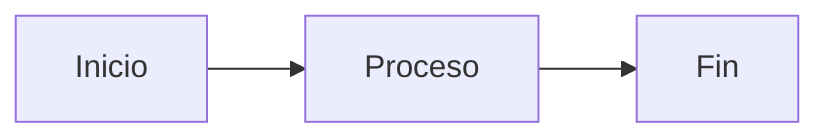

# Contributing

¡Gracias por tu interés en contribuir a Hipos! Este documento explica cómo puedes participar.

## Cómo Contribuir

### Reportar Bugs

¿Encontraste un bug? Abre un issue en GitHub con:

1. **Título descriptivo**: "ElementWrapper.SetText falla con ComboBox"
2. **Descripción detallada**:
   - Qué esperabas que pasara
   - Qué pasó realmente
   - Pasos para reproducir
3. **Entorno**:
   - OS: Windows 10/11
   - .NET Version: 8.0.x
   - FlaUI Version: 4.0.x
4. **Código de ejemplo**:
```csharp
var element = FindElement("ComboBoxId");
element.SetText("value");  // Lanza excepción aquí
```
5. **Logs/Screenshots**: Si es posible

### Sugerir Mejoras

¿Tienes una idea? Abre un issue con:

1. **Título**: "Feature: Soporte para drag & drop"
2. **Caso de uso**: Por qué es útil
3. **Propuesta**: Cómo podría implementarse
4. **Alternativas**: Otras opciones consideradas

### Contribuir Código

#### 1. Fork y Clone

```bash
# Fork en GitHub primero, luego:
git clone https://github.com/TU_USUARIO/Hipos.git
cd Hipos
git remote add upstream https://github.com/ORIGINAL_OWNER/Hipos.git
```

#### 2. Crear Branch

```bash
git checkout -b feature/mi-nueva-feature
# o
git checkout -b bugfix/arreglar-elemento-wrapper
```

**Convención de nombres:**
- `feature/nombre-descriptivo` - Nueva funcionalidad
- `bugfix/nombre-descriptivo` - Corrección de bug
- `docs/nombre-descriptivo` - Cambios en documentación
- `refactor/nombre-descriptivo` - Refactoring sin cambio funcional

#### 3. Hacer Cambios

Sigue las guías de estilo (ver abajo).

#### 4. Testear

```bash
# Ejecutar todos los tests
dotnet test

# Verificar que tus cambios funcionan
dotnet test --filter "FullyQualifiedName~MyNewTest"
```

#### 5. Commit

```bash
git add .
git commit -m "feat: agregar soporte para drag and drop

- Implementar DragAndDropHelper
- Añadir tests para drag and drop
- Actualizar documentación

Closes #123"
```

**Formato de commit messages:**
- `feat:` Nueva funcionalidad
- `fix:` Corrección de bug
- `docs:` Cambios en documentación
- `style:` Formateo, espacios, etc.
- `refactor:` Refactoring de código
- `test:` Añadir o modificar tests
- `chore:` Mantenimiento, deps, etc.

#### 6. Push y Pull Request

```bash
git push origin feature/mi-nueva-feature
```

En GitHub:
1. Crear Pull Request desde tu branch
2. Llenar template de PR (descripción, tests, checklist)
3. Esperar review
4. Aplicar feedback si es necesario
5. Merge cuando sea aprobado

## Guías de Estilo

### C# Code Style

#### General

- **Indentación**: 4 espacios (no tabs)
- **Encoding**: UTF-8
- **Line endings**: CRLF (Windows)
- **Naming**: PascalCase para tipos, camelCase para variables

#### Convenciones

```csharp
// Namespaces
using System;
using FlaUI.Core;
using Hipos.Framework.Core;

namespace Hipos.Framework.Utils;  // File-scoped namespace (C# 10+)

// Clases
public class MyHelper
{
    // Campos privados: _camelCase
    private readonly string _fieldName;
    private static readonly object _lock = new();
    
    // Propiedades: PascalCase
    public string PropertyName { get; set; }
    protected int ProtectedProperty { get; }
    
    // Métodos: PascalCase
    public void DoSomething()
    {
        // Variables locales: camelCase
        var localVariable = "value";
        
        // Constantes: PascalCase
        const string ConstantValue = "CONSTANT";
    }
    
    // Métodos privados: PascalCase (no _ prefix)
    private void HelperMethod()
    {
    }
}
```

#### Documentación

Añade XML comments a APIs públicas:

```csharp
/// <summary>
/// Hace click en un elemento después de esperar a que sea clickeable.
/// </summary>
/// <param name="element">Elemento a hacer click</param>
/// <param name="timeoutMs">Timeout en milisegundos</param>
/// <returns>True si click fue exitoso, false en caso contrario</returns>
/// <exception cref="ArgumentNullException">Si element es null</exception>
public bool ClickElement(AutomationElement element, int timeoutMs = 5000)
{
    // Implementación
}
```

#### Null Safety

```csharp
// Usa nullable reference types
public string? GetText()  // Puede retornar null
{
    return element?.Name;
}

// Valida argumentos
public void DoSomething(string value)
{
    ArgumentNullException.ThrowIfNull(value);
    // o
    if (value == null) throw new ArgumentNullException(nameof(value));
}
```

#### LINQ y Modern C#

```csharp
// Preferir LINQ
var enabled = elements.Where(e => e.IsEnabled).ToList();

// Usar pattern matching
if (element is Button button)
{
    button.Click();
}

// String interpolation
Log.Information("Elemento {Name} tiene estado {State}", element.Name, element.State);
```

### Convenciones de Tests

```csharp
[TestFixture]
[Category("Smoke")]
[AllureSuite("Feature Tests")]
public class FeatureTests : BaseTest
{
    // Test name: Descriptivo y específico
    [Test]
    [AllureTag("tag1", "tag2")]
    [AllureDescription("Descripción detallada de qué verifica el test")]
    public void VerifyFeature_WithCondition_ExpectedResult()
    {
        // Arrange: Preparar datos y estado
        var page = new FeaturePage(MainWindow!);
        var testData = "test value";
        
        // Act: Ejecutar acción
        page.DoSomething(testData);
        
        // Assert: Verificar resultado
        Assert.That(page.GetResult(), Is.EqualTo("expected"));
    }
}
```

### Page Objects

```csharp
public class MyPage : BasePage
{
    // AutomationIds: constantes privadas
    private const string ElementId = "ElementAutomationId";
    
    public MyPage(Window window) : base(window)
    {
        AllureApi.Step("Navegando a MyPage");
    }
    
    // Acciones: verbos públicos
    public void DoAction()
    {
        AllureApi.Step("Ejecutando acción");
        var element = FindElement(ElementId);
        element.Click();
    }
    
    // Getters: retornar valores, no elementos
    public string GetResult()
    {
        var element = FindElement(ElementId);
        return element.GetText();
    }
    
    // No exponer AutomationElements directamente
    // ❌ public AutomationElement GetElement() { }
}
```

## Añadir Nuevas Funcionalidades

### Nuevo Helper

**1. Crear archivo en `src/Hipos.Framework/Utils/`:**

```csharp
namespace Hipos.Framework.Utils;

/// <summary>
/// Helper para operaciones de drag & drop.
/// </summary>
public static class DragDropHelper
{
    /// <summary>
    /// Realiza drag & drop entre dos elementos.
    /// </summary>
    public static void DragAndDrop(
        AutomationElement source,
        AutomationElement target)
    {
        // Implementación
    }
}
```

**2. Añadir tests:**

```csharp
// En Hipos.Tests/Tests/
[TestFixture]
public class DragDropHelperTests : BaseTest
{
    [Test]
    public void VerifyDragDrop_BetweenElements_Success()
    {
        // Test aquí
    }
}
```

**3. Actualizar documentación:**

Añadir sección en `website/docs/framework-guide.md`:

```markdown
## DragDropHelper

Helper para operaciones drag & drop...
```

### Nuevo Page Object

**1. Crear en `src/Hipos.Tests/PageObjects/`:**

```csharp
public class NewPage : BasePage
{
    // Implementación
}
```

**2. Crear tests que usen el Page Object**

**3. Documentar en `framework-guide.md`**

### Nuevo Test Suite

**1. Crear en `src/Hipos.Tests/Tests/`:**

```csharp
[TestFixture]
[Category("NewCategory")]
[AllureSuite("New Feature Tests")]
public class NewFeatureTests : BaseTest
{
    // Tests aquí
}
```

**2. Ejecutar y verificar:**

```bash
dotnet test --filter "Category=NewCategory"
```

## Actualizar Documentación

### Documentación del Framework (Docusaurus)

**Ubicación:** `website/docs/`

**Añadir nueva página:**

1. Crear archivo markdown: `website/docs/mi-nueva-pagina.md`

```markdown
---
sidebar_position: 9
---

# Mi Nueva Página

Contenido aquí...
```

2. Actualizar sidebar: `website/sidebars.ts`

```typescript
{
  type: 'doc',
  id: 'mi-nueva-pagina',
  label: 'Mi Nueva Página',
}
```

3. Previsualizar localmente:

```bash
cd website
npm install
npm start
# Abrir http://localhost:3000
```

### Diagramas Mermaid

Docusaurus soporta Mermaid para diagramas:

```markdown

```

**Tipos de diagramas:**
- `graph` / `flowchart` - Diagramas de flujo
- `sequenceDiagram` - Diagramas de secuencia
- `classDiagram` - Diagramas de clases
- `stateDiagram` - Diagramas de estado

### README y Documentación In-Code

- **README.md**: Mantener actualizado con cambios principales
- **XML Comments**: Documentar APIs públicas
- **Inline comments**: Solo cuando código no es auto-explicativo

## Checklist Pre-PR

Antes de crear Pull Request, verifica:

- [ ] Código compila sin warnings
- [ ] Tests pasan localmente (`dotnet test`)
- [ ] Nuevas funcionalidades tienen tests
- [ ] Documentación actualizada
- [ ] Commits siguen convención
- [ ] Sin archivos innecesarios (bin/, obj/, logs/)
- [ ] Código sigue guías de estilo
- [ ] XML comments en APIs públicas nuevas

## Proceso de Review

1. **Automated Checks**: CI ejecuta automáticamente
   - Build
   - Tests
   - Linting (si configurado)

2. **Code Review**: Mantenedor revisa:
   - Calidad de código
   - Cobertura de tests
   - Documentación
   - Adherencia a guías

3. **Feedback**: Puede solicitar cambios
   - Responde en la conversación del PR
   - Haz commits adicionales con cambios
   - Push actualiza PR automáticamente

4. **Approval**: Una vez aprobado
   - Mantenedor hace merge
   - Branch puede ser eliminado

## Código de Conducta

- 🤝 Sé respetuoso y profesional
- 💬 Proporciona feedback constructivo
- 🧠 Mantén mente abierta
- 🎯 Enfócate en el código, no en la persona
- 📚 Ayuda a otros a aprender

## Mejoras Futuras

Ideas de contribuciones que serían valiosas:

### Framework
- [ ] Soporte para drag & drop
- [ ] Helpers para manejo de grids/tablas
- [ ] Soporte para multiple windows simultáneas
- [ ] Video recording de tests
- [ ] Parallel execution (con múltiples runners)

### Documentación
- [ ] Videos tutoriales
- [ ] Más ejemplos en docs
- [ ] Traducción a inglés completa
- [ ] Guía de migración desde Coded UI

### CI/CD
- [ ] Guía detallada de Azure DevOps
- [ ] Ejemplo de Jenkins pipeline
- [ ] Docker support (experimental)

### Testing
- [ ] Más tests del framework mismo
- [ ] Performance benchmarks
- [ ] Tests de integración end-to-end

## Recursos

- [C# Coding Conventions](https://docs.microsoft.com/en-us/dotnet/csharp/fundamentals/coding-style/coding-conventions)
- [FlaUI Documentation](https://github.com/FlaUI/FlaUI)
- [NUnit Documentation](https://docs.nunit.org/)
- [Conventional Commits](https://www.conventionalcommits.org/)

## Contacto

¿Preguntas? Abre un issue o discusión en GitHub.

¡Gracias por contribuir! 🎉
