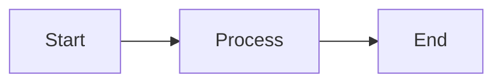

# Contributing

Thank you for your interest in contributing to Hipos! This document explains how you can participate.

## How to Contribute

### Report Bugs

Found a bug? Open an issue on GitHub with:

1. **Descriptive title**: "BasePage.SetElementText fails with ComboBox"
2. **Detailed description**:
   - What you expected to happen
   - What actually happened
   - Steps to reproduce
3. **Environment**:
   - OS: Windows 10/11
   - .NET Version: 8.0.x
   - FlaUI Version: 4.0.x
4. **Sample code**:

```csharp
SetElementText("value", "Parent", "ComboBoxId");  // Throws exception here
```

5. **Logs/Screenshots**: If possible

### Suggest Improvements

Have an idea? Open an issue with:

1. **Title**: "Feature: Support for drag & drop"
2. **Use case**: Why it's useful
3. **Proposal**: How it could be implemented
4. **Alternatives**: Other options considered

### Contribute Code

#### 1. Fork and Clone

```bash
# Fork on GitHub first, then:
git clone https://github.com/YOUR_USERNAME/Hipos.git
cd Hipos
git remote add upstream https://github.com/ORIGINAL_OWNER/Hipos.git
```

#### 2. Create Branch

```bash
git checkout -b feature/my-new-feature
# or
git checkout -b bugfix/fix-element-wrapper
```

**Naming convention:**
- `feature/descriptive-name` - New functionality
- `bugfix/descriptive-name` - Bug fix
- `docs/descriptive-name` - Documentation changes
- `refactor/descriptive-name` - Refactoring without functional change

#### 3. Make Changes

Follow the style guides (see below).

#### 4. Test

```bash
# Run all tests
dotnet test

# Verify your changes work
dotnet test --filter "FullyQualifiedName~MyNewTest"
```

#### 5. Commit

```bash
git add .
git commit -m "feat: add drag and drop support

- Implement DragAndDropHelper
- Add tests for drag and drop
- Update documentation

Closes #123"
```

**Commit message format:**
- `feat:` New functionality
- `fix:` Bug fix
- `docs:` Documentation changes
- `style:` Formatting, spaces, etc.
- `refactor:` Code refactoring
- `test:` Add or modify tests
- `chore:` Maintenance, dependencies, etc.

#### 6. Push and Pull Request

```bash
git push origin feature/my-new-feature
```

On GitHub:
1. Create Pull Request from your branch
2. Fill out PR template (description, tests, checklist)
3. Wait for review
4. Apply feedback if necessary
5. Merge when approved

## Style Guides

### C# Code Style

#### General

- **Indentation**: 4 spaces (no tabs)
- **Encoding**: UTF-8
- **Line endings**: CRLF (Windows)
- **Naming**: PascalCase for types, camelCase for variables

#### Conventions

```csharp
// Namespaces
using System;
using FlaUI.Core;
using Hipos.Framework.Core;

namespace Hipos.Framework.Utils;  // File-scoped namespace (C# 10+)

// Classes
public class MyHelper
{
    // Private fields: _camelCase
    private readonly string _fieldName;
    private static readonly object _lock = new();
    
    // Properties: PascalCase
    public string PropertyName { get; set; }
    protected int ProtectedProperty { get; }
    
    // Methods: PascalCase
    public void DoSomething()
    {
        // Local variables: camelCase
        var localVariable = "value";
        
        // Constants: PascalCase
        const string ConstantValue = "CONSTANT";
    }
    
    // Private methods: PascalCase (no _ prefix)
    private void HelperMethod()
    {
    }
}
```

#### Documentation

Add XML comments to public APIs:

```csharp
/// <summary>
/// Clicks an element after waiting for it to be clickable.
/// </summary>
/// <param name="element">Element to click</param>
/// <param name="timeoutMs">Timeout in milliseconds</param>
/// <returns>True if click was successful, false otherwise</returns>
/// <exception cref="ArgumentNullException">If element is null</exception>
public bool ClickElement(AutomationElement element, int timeoutMs = 5000)
{
    // Implementation
}
```

#### Null Safety

```csharp
// Use nullable reference types
public string? GetText()  // Can return null
{
    return element?.Name;
}

// Validate arguments
public void DoSomething(string value)
{
    ArgumentNullException.ThrowIfNull(value);
    // or
    if (value == null) throw new ArgumentNullException(nameof(value));
}
```

#### LINQ and Modern C#

```csharp
// Prefer LINQ
var enabled = elements.Where(e => e.IsEnabled).ToList();

// Use pattern matching
if (element is Button button)
{
    button.Click();
}

// String interpolation
Log.Information("Element {Name} has state {State}", element.Name, element.State);
```

### Test Conventions

```csharp
[Binding]
public class FeatureStepDefinitions : BaseStepDefinitions
{
    private FeaturePage? _page;

    [Given("the feature page is open")]
    public void GivenTheFeaturePageIsOpen()
    {
        Assert.That(MainWindow, Is.Not.Null);
        _page = new FeaturePage(MainWindow!);
    }

    [When("I execute the feature with \"(.*)\"")]
    public void WhenIExecuteTheFeature(string input)
    {
        _page!.DoSomething(input);
    }

    [Then("the result should be \"(.*)\"")]
    public void ThenTheResultShouldBe(string expected)
    {
        Assert.That(_page!.GetResult(), Is.EqualTo(expected));
        LogPass("Feature verified successfully");
    }
}
```

### Page Objects

```csharp
public class MyPage : BasePage
{
    // AutomationIds: private constants
    private const string ElementId = "ElementAutomationId";
    
    public MyPage(Window window) : base(window)
    {
        Log.Information("Navigating to MyPage");
    }
    
    // Actions: public verbs
    public void DoAction()
    {
        Log.Information("Executing action");
        ClickElement("Parent", ElementId);
    }
    
    // Getters: return values, not elements
    public string GetResult()
    {
        var element = FindElementByPath("Parent", ElementId);
        return element.GetName() ?? string.Empty;
    }
    
    // Don't expose AutomationElements directly
    // ❌ public AutomationElement GetElement() { }
}
```

### Language Standards

**IMPORTANT**: All code, documentation, and comments must be in **English only**.

✅ **DO:**
- Write all code comments in English
- Write all documentation in English
- Use English in log messages
- Use English in test descriptions

❌ **DON'T:**
- Mix Spanish and English in the same file
- Write comments in Spanish
- Use Spanish variable names or method names

**Exception**: UI element names in tests may be in Spanish/English for compatibility with localized Windows applications (e.g., "Aceptar" or "Accept").

## Add New Features

### New Helper

**1. Create file in `src/Hipos.Framework/Utils/`:**

```csharp
namespace Hipos.Framework.Utils;

/// <summary>
/// Helper for drag & drop operations.
/// </summary>
public static class DragDropHelper
{
    /// <summary>
    /// Performs drag & drop between two elements.
    /// </summary>
    public static void DragAndDrop(
        AutomationElement source,
        AutomationElement target)
    {
        // Implementation
    }
}
```

**2. Add tests:**

```gherkin
# In Hipos.Tests/Features/DragDrop.feature
Feature: Drag and drop
  Scenario: Drag element A to element B
    Given the drag-drop page is open
    When I drag element A to element B
    Then the drop should be successful
```

**3. Update documentation:**

Add section in `website/docs/framework-guide.md`:

```markdown
## DragDropHelper

Helper for drag & drop operations...
```

### New Page Object

**1. Create in `src/Hipos.Tests/PageObjects/`:**

```csharp
public class NewPage : BasePage
{
    // Implementation
}
```

**2. Create tests that use the Page Object**

**3. Document in `framework-guide.md`**

### New Test Suite

**1. Create in `src/Hipos.Tests/Features/`:**

```gherkin
Feature: New feature
  @NewCategory
  Scenario: Happy path
    Given the new feature page is open
    When I execute the new feature
    Then I should see the expected result
```

**2. Run and verify:**

```bash
dotnet test --filter "TestCategory=NewCategory"
```

## Update Documentation

### Framework Documentation (Docusaurus)

**Location:** `website/docs/`

**Add new page:**

1. Create markdown file: `website/docs/my-new-page.md`

```markdown
---
sidebar_position: 9
---

# My New Page

Content here...
```

2. Update sidebar: `website/sidebars.ts`

```typescript
{
  type: 'doc',
  id: 'my-new-page',
  label: 'My New Page',
}
```

3. Preview locally:

```bash
cd website
npm install
npm start
# Open http://localhost:3000
```

### Mermaid Diagrams

Docusaurus supports Mermaid for diagrams:

````markdown

````

**Diagram types:**
- `graph` / `flowchart` - Flow diagrams
- `sequenceDiagram` - Sequence diagrams
- `classDiagram` - Class diagrams
- `stateDiagram` - State diagrams

### README and In-Code Documentation

- **README.md**: Keep updated with major changes
- **XML Comments**: Document public APIs
- **Inline comments**: Only when code is not self-explanatory

## Pre-PR Checklist

Before creating Pull Request, verify:

- [ ] Code compiles without warnings
- [ ] Tests pass locally (`dotnet test`)
- [ ] New features have tests
- [ ] Documentation updated
- [ ] Commits follow convention
- [ ] No unnecessary files (bin/, obj/, logs/)
- [ ] Code follows style guides
- [ ] XML comments on new public APIs
- [ ] All content in English (no Spanish)

## Review Process

1. **Automated Checks**: CI runs automatically
   - Build
   - Tests
   - Linting (if configured)

2. **Code Review**: Maintainer reviews:
   - Code quality
   - Test coverage
   - Documentation
   - Adherence to guides

3. **Feedback**: May request changes
   - Respond in PR conversation
   - Make additional commits with changes
   - Push updates PR automatically

4. **Approval**: Once approved
   - Maintainer merges
   - Branch can be deleted

## Code of Conduct

- 🤝 Be respectful and professional
- 💬 Provide constructive feedback
- 🧠 Keep an open mind
- 🎯 Focus on the code, not the person
- 📚 Help others learn

## Future Improvements

Valuable contribution ideas:

### Framework
- [ ] Support for drag & drop
- [ ] Helpers for grid/table handling
- [ ] Support for multiple simultaneous windows
- [ ] Video recording of tests
- [ ] Parallel execution (with multiple runners)

### Documentation
- [ ] Tutorial videos
- [ ] More examples in docs
- [ ] Migration guide from Coded UI
- [ ] Best practices guide

### CI/CD
- [ ] Detailed Azure DevOps guide
- [ ] Jenkins pipeline example
- [ ] Docker support (experimental)
- [ ] Xray upload automation examples

### Testing
- [ ] More tests of the framework itself
- [ ] Performance benchmarks
- [ ] End-to-end integration tests

## Resources

- [C# Coding Conventions](https://docs.microsoft.com/en-us/dotnet/csharp/fundamentals/coding-style/coding-conventions)
- [FlaUI Documentation](https://github.com/FlaUI/FlaUI) - For window management APIs
- **Note:** Hipos uses FlaUI for launching applications and managing windows. MSAA (Microsoft Active Accessibility) is used for UI element interactions, accessed through window handles provided by FlaUI.
- [NUnit Documentation](https://docs.nunit.org/)
- [SpecFlow Documentation](https://docs.specflow.org/)
- [ExtentReports Documentation](https://www.extentreports.com/)
- [Conventional Commits](https://www.conventionalcommits.org/)

## Contact

Questions? Open an issue or discussion on GitHub.

Thank you for contributing! 🎉
