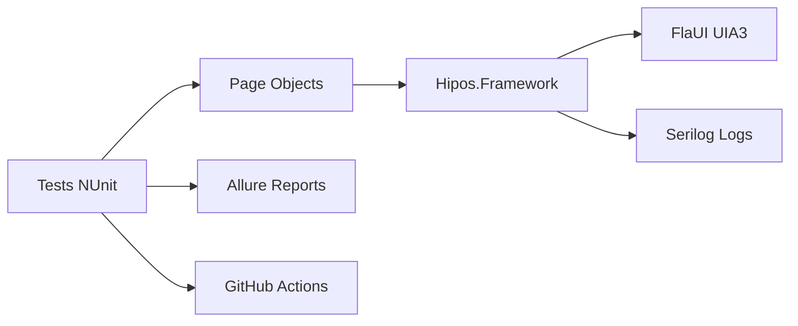

# Introducción

Bienvenido a la documentación de **Hipos** - un framework enterprise de automatización para aplicaciones Windows.

## ¿Qué es Hipos?

Hipos es un framework completo de automatización de UI para aplicaciones Windows (Win32, WPF, WinForms) construido con las mejores prácticas de la industria. Combina tecnologías modernas con patrones de diseño probados para proporcionar una solución robusta y mantenible.

## Características Principales

### 🎯 Automatización Robusta
- **FlaUI con UIA3**: Tecnología de automatización UI de última generación
- **Búsqueda Híbrida**: Sistema inteligente que detecta ventanas UWP y Win32 clásicas
- **Esperas Inteligentes**: Sistema de waits explícitas con retry configurable
- **Manejo de Errores**: Captura automática de screenshots y logs en caso de fallos
- **Tests Complejos**: Interacciones reales con aplicaciones (clicks, inputs, validaciones)

### 📊 Reporting Profesional
- **Allure Reports**: Reportes HTML interactivos y visuales
- **Screenshots Automáticos**: Captura de evidencia al fallar cualquier test
- **Logs Detallados**: Serilog con diferentes niveles y formato configurable
- **Artifacts para CI**: Exportación de resultados para integración continua

### ⚙️ Listo para Enterprise
- **Page Object Pattern**: Separación clara de lógica de test y elementos UI
- **Configuración Flexible**: appsettings.json + variables de entorno
- **Categorización**: Tests de smoke, regression, y custom tags
- **CI/CD Ready**: Workflows para GitHub Actions y guía de Azure DevOps

### 🔧 Developer Friendly
- **C# + .NET 8**: Lenguaje moderno y tipado fuerte
- **NUnit**: Framework de testing maduro y ampliamente adoptado
- **Documentación Completa**: Portal Docusaurus con ejemplos y guías
- **Código Limpio**: Helpers, wrappers y utilidades bien organizadas

## Stack Tecnológico

| Componente | Tecnología | Versión |
|------------|-----------|---------|
| Lenguaje | C# | .NET 9 |
| Test Runner | NUnit | 4.2+ |
| UI Automation | FlaUI | 4.0+ |
| Reporting | Allure | 2.12+ |
| Logging | Serilog | 3.1+ |
| CI/CD | GitHub Actions | - |

## Estado del Proyecto

✅ **Production-Ready** - Framework completamente funcional

**Tests Actuales:**
- 11 tests automatizados (4 básicos + 7 complejos)
- Tests contra Calculadora de Windows
- Operaciones matemáticas completas (suma, resta, multiplicación, división)
- Operaciones secuenciales encadenadas
- Validaciones de UI y funcionalidad

**Tiempo de Ejecución:**
- Tests básicos: ~35ms
- Tests complejos: ~16-25s
- Tasa de éxito: 100%

## Casos de Uso

Hipos es ideal para:

- ✅ Automatización de aplicaciones desktop legacy (Win32, WinForms)
- ✅ Testing de aplicaciones WPF modernas
- ✅ Regression testing de aplicaciones Windows empresariales
- ✅ Smoke tests en pipelines de CI/CD
- ✅ Validación de integración entre componentes UI
- ✅ Testing de aplicaciones con UI compleja (grids, trees, custom controls)

## ¿Por qué Hipos?

### vs. Coded UI (deprecated)
Coded UI está deprecado desde Visual Studio 2019. Hipos usa FlaUI, una librería activamente mantenida y moderna.

### vs. WinAppDriver
WinAppDriver requiere que la app sea instrumentada y tiene limitaciones con controles custom. FlaUI/UIA3 funciona con cualquier aplicación Windows estándar.

### vs. Scripting manual
Hipos proporciona estructura, patrones, helpers y toda la infraestructura lista (reporting, logging, CI/CD).

## Próximos Pasos

1. **[Getting Started](./getting-started.md)** - Configura tu entorno e instala Hipos
2. **[Arquitectura](./architecture.md)** - Entiende la estructura del framework
3. **[Framework Guide](./framework-guide.md)** - Aprende a usar los componentes principales
4. **[CI/CD](./ci-cd.md)** - Integra con tus pipelines

¿Listo para empezar? 👉 [Getting Started](./getting-started.md)
