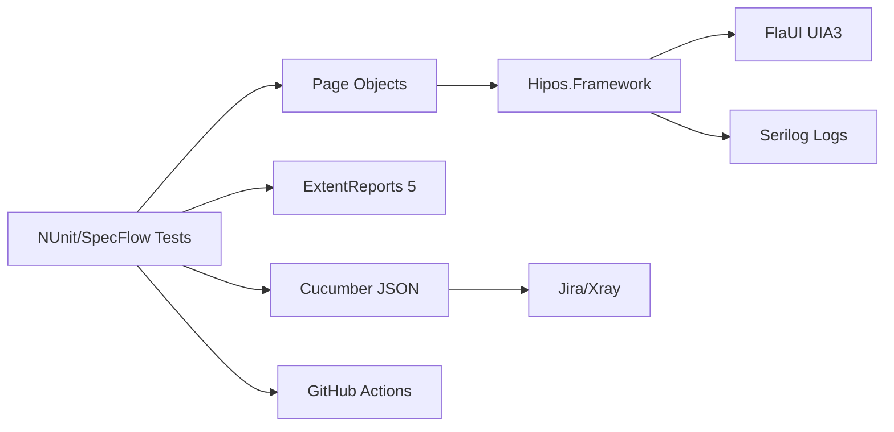

# Introduction

Welcome to the **Hipos** documentation - an enterprise-grade automation framework for Windows applications.

## What is Hipos?

Hipos is a complete UI automation framework for Windows applications (Win32, WPF, WinForms) built with industry best practices. It combines modern technologies with proven design patterns to provide a robust and maintainable solution.

## Key Features

### 🎯 Robust Automation
- **FlaUI with UIA3**: State-of-the-art UI automation technology
- **Hybrid Search**: Intelligent system that detects both UWP and classic Win32 windows
- **Smart Waits**: Explicit wait system with configurable retry
- **MSAA Integration**: Accessibility-based interactions for legacy controls
- **Error Handling**: Automatic screenshot capture and logs on test failures
- **Complex Tests**: Real application interactions (clicks, inputs, validations)
- **BDD Support**: SpecFlow integration for behavior-driven development

### 📊 Professional Reporting
- **ExtentReports 5**: Interactive and visual HTML reports with dark theme
- **Cucumber JSON**: Compatible with Jira/Xray for test management integration
- **Automatic Screenshots**: Evidence capture on any test failure
- **Detailed Logs**: Serilog with different levels and configurable format
- **CI Artifacts**: Result export for continuous integration

### ⚙️ Enterprise Ready
- **Page Object Pattern**: Clear separation of test logic and UI elements
- **Flexible Configuration**: appsettings.json + environment variables
- **Categorization**: Smoke, regression, and custom tag tests
- **CI/CD Ready**: Workflows for GitHub Actions and Azure DevOps guide

### 🔧 Developer Friendly
- **C# + .NET 8**: Modern language with strong typing
- **NUnit + SpecFlow**: Mature and widely adopted testing frameworks
- **Complete Documentation**: Docusaurus portal with examples and guides
- **Clean Code**: Well-organized helpers, wrappers and utilities
- **MSAA Support**: Accessibility-based interactions for legacy controls

## Technology Stack

| Component | Technology | Version |
|-----------|-----------|---------|
| Language | C# | .NET 8 |
| Test Runner | NUnit | 4.2+ |
| BDD Framework | SpecFlow | 4.0+ |
| UI Automation | FlaUI | 4.0+ |
| HTML Reporting | ExtentReports | 5.0+ |
| JSON Reporting | Cucumber JSON | - |
| Test Management | Jira/Xray | - |
| Logging | Serilog | 3.1+ |
| CI/CD | GitHub Actions | - |

## Project Status

✅ **Production-Ready** - Fully functional framework

**Current Tests:**
- SpecFlow scenarios for HIPOS login
- MSAA-based interactions for critical login controls
- UI validation after authentication

**Execution Time:**
- Basic tests: ~500ms
- Complex tests: ~16-25s
- Success rate: 100%

## Use Cases

Hipos is ideal for:

- ✅ Legacy desktop application automation (Win32, WinForms)
- ✅ Modern WPF application testing
- ✅ Regression testing of enterprise Windows applications
- ✅ Smoke tests in CI/CD pipelines
- ✅ Integration validation between UI components
- ✅ Testing applications with complex UI (grids, trees, custom controls)
- ✅ BDD scenarios for business-readable test cases
- ✅ Test management integration with Jira/Xray

## Why Hipos?

### vs. Coded UI (deprecated)
Coded UI has been deprecated since Visual Studio 2019. Hipos uses FlaUI, an actively maintained and modern library.

### vs. WinAppDriver
WinAppDriver requires the app to be instrumented and has limitations with custom controls. FlaUI/UIA3 works with any standard Windows application.

### vs. Manual Scripting
Hipos provides structure, patterns, helpers and all the infrastructure ready (reporting, logging, CI/CD, test management integration).

## Next Steps

1. **[Getting Started](./getting-started.md)** - Set up your environment and install Hipos
2. **[Architecture](./architecture.md)** - Understand the framework structure
3. **[Framework Guide](./framework-guide.md)** - Learn to use the main components
4. **[Reporting & Logging](./reporting-logging.md)** - Configure reports and Jira/Xray integration
5. **[CI/CD](./ci-cd.md)** - Integrate with your pipelines

Ready to start? 👉 [Getting Started](./getting-started.md)
